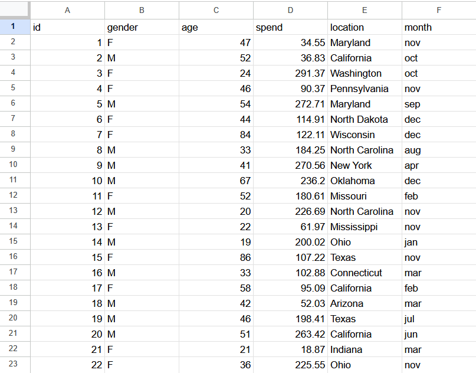

# Overview

## How to run the application

After cloning or downloading the repo:

### Client
```bash
cd client
npm install
npm run dev
```
### Server
```bash
cd server
npm install
node index.js
````
### Usage

Open your browser and navigate to the localhost address running in the client.

You can upload the sample customer_data_10k.csv using the Browse button.

Or upload any CSV file that follows the required formatting
(see data format picture below).

