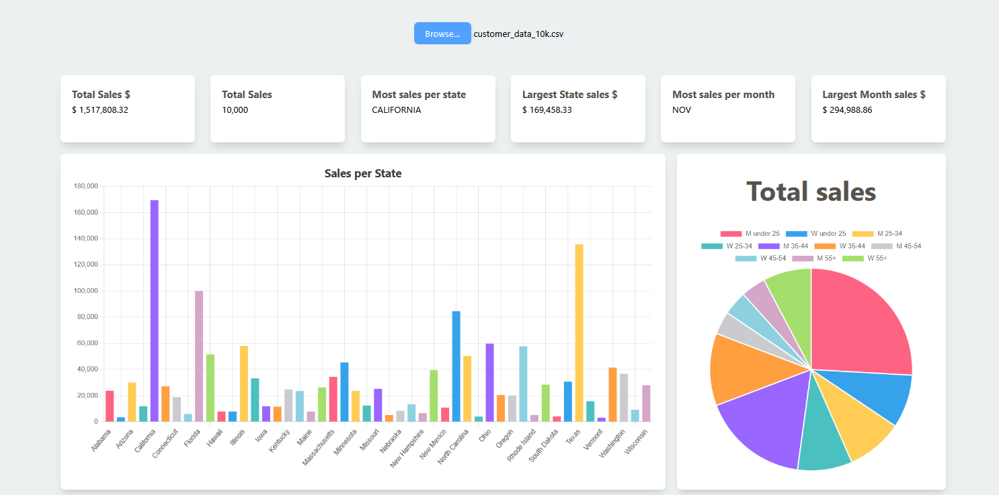
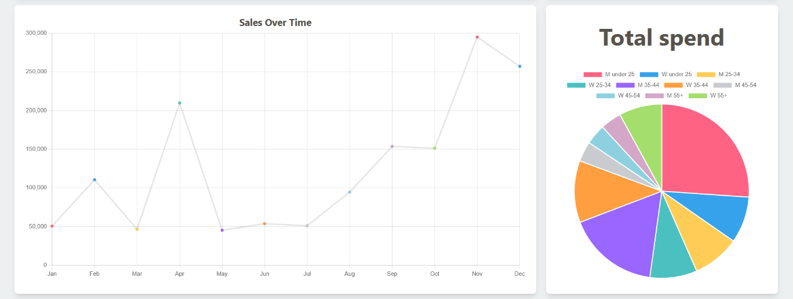

# Overview

## How to run the application

After cloning or downloading the repo:

### Client
```bash
cd client
npm install
npm run dev
```
### Server
```bash
cd server
npm install
node index.js
````
### Usage

Open your browser and navigate to the localhost address running in the client.

You can upload the sample customer_data_10k.csv using the Browse button.

Or upload any CSV file that follows the required formatting
(see data format picture below).


After the data is uploaded you can see insights and charts such as:
  Total money spent
  Total number of sales
  State with most sales
  Amount made in that state
  Month with most sales
  Amount made in that month
  Bar chart of sales per state
  Line chart of sales over time
  Pie charts with gender and age demographic data

as displayed below



## Data Pipeline

This project uses a lightweight Node.js/Express backend to ingest, process, and return structured insights from uploaded CSV files. The pipeline is designed to be fast, modular, and easy to extend with additional data transformations.

---

### Overview

1. A CSV file is uploaded from the frontend via an HTTP POST request.
2. The server parses the CSV into structured JavaScript objects.
3. The data is processed through multiple transformation modules (demographic, geographic, and temporal splits).
4. The processed results are returned to the client as JSON.
5. Temporary files are cleaned up after processing.

---

### Pipeline Flow

#### 1. File Upload
The `/upload` endpoint accepts a single CSV file using **Multer**, which temporarily stores the file on disk in the `uploads/` directory.

This allows large files to be streamed and processed efficiently without loading the entire file into memory at once.

---

#### 2. CSV Parsing
The uploaded file is read as a stream and parsed using `csv-parser`. Each row is converted into a JavaScript object and collected into an array.

This streaming-based approach ensures good performance even with large datasets.

---

#### 3. Data Transformation
Once parsing is complete, the raw data is passed through three independent processing modules:

- **`demoSplit`** – Groups or aggregates data by demographic attributes (e.g., gender).
- **`stateSplit`** – Organizes data by geographic location (U.S. state).
- **`monthSplit`** – Splits or aggregates data by time period (month).

Each module receives the full dataset and returns a processed summary, keeping the pipeline modular and easy to extend.

---

#### 4. Response Construction
The processed outputs are combined into a single structured object and returned to the client as JSON:

```json
{
  "success": true,
  "data": {
    "processed": {
      "genderSplit": {},
      "locationSplit": {},
      "dateSplit": {}
    }
  }
}
```

This response format is designed to be easily consumed by frontend visualizations such as charts and dashboards.
5. Cleanup

After processing completes, the temporary uploaded file is deleted from disk to prevent storage buildup and keep the server stateless.
Design Notes

  Streaming-based CSV parsing avoids memory bottlenecks.

  Modular transformation functions allow new analytics to be added without changing the core pipeline.

  CORS-enabled API supports frontend frameworks like React.

  Stateless request handling ensures each upload is processed independently.
